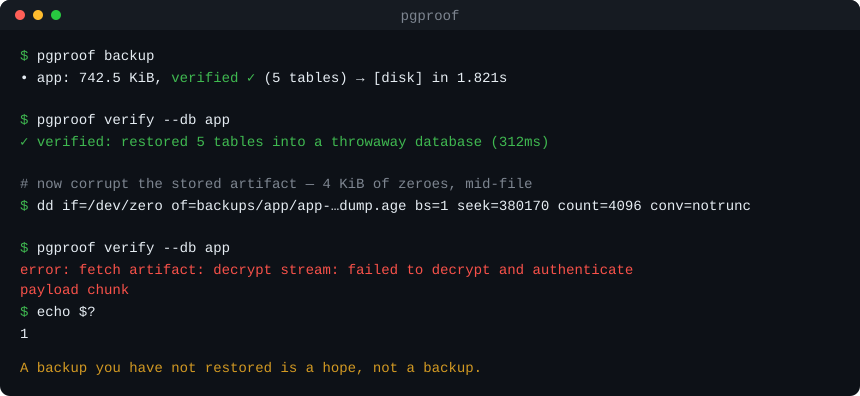

<div align="center">

# pgproof

**Postgres & MySQL backups you've _proven_ restore.**

[](https://github.com/shaxzodbek-uzb/pgproof/releases)
[](https://goreportcard.com/report/github.com/shaxzodbek-uzb/pgproof)
[](LICENSE)

</div>

A backup you haven't restored is a hope, not a backup. **pgproof** dumps your
database, encrypts it, ships it to S3/R2/local/Telegram — and then **restores it
into a throwaway database to prove it actually works.** If a backup can't be
restored, it pings you on Telegram *today*, not the morning your primary dies.

<p align="center">
  
</p>

That `verified ✓` is the whole point. Every other line of this README is in
service of it — and the last two commands above are why: when the stored artifact
is damaged, `verify` fails loudly instead of reporting a backup you don't have.

---

## Why another backup tool?

| | restore-test built in | single static binary | encrypted | S3/R2 + Telegram | one-command restore |
|---|:---:|:---:|:---:|:---:|:---:|
| **pgproof** | ✅ **every backup** | ✅ | ✅ age | ✅ | ✅ |
| `pg_dump` + cron + s3 | ❌ | — | DIY | DIY | ❌ |
| postgres-backup-s3 (Docker) | ❌ | ❌ | gpg | ❌ Telegram | ❌ |
| pgBackRest / Barman | manual | ❌ | ✅ | ❌ | partial |

pgBackRest and Barman are excellent for large, WAL-based, point-in-time setups.
pgproof is for the other 90%: a homelab, a side project, a small SaaS that just
wants **nightly logical backups it can trust**, with zero moving parts.

## Features

- 🔁 **Verified restores** — after each backup, pgproof spins up a throwaway
  database, restores into it, checks it has tables (and optionally that key
  tables aren't empty), then drops it. No manual fire drills.
- 🔒 **Encrypted at rest** — streaming [age](https://age-encryption.org)
  encryption, passphrase or public-key. Multi-GB dumps never touch RAM.
- ☁️ **Anywhere storage** — S3, **Cloudflare R2**, DigitalOcean Spaces, MinIO,
  local/NAS path, and Telegram as a write-only off-site copy. Fan out to several
  at once.
- 📣 **It pages you** — Telegram alerts on success/failure, a
  [healthchecks.io](https://healthchecks.io) dead-man's switch, and a JSON webhook
  (Slack/Discord work as-is).
- 📈 **Monitorable** — `pgproof status` exits non-zero when a database has no recent
  *verified* backup, and [Prometheus metrics](#prometheus) come out of the same data.
- 🗂️ **Retention** — grandfather-father-son (`keep last / daily / weekly / monthly`).
- ⏰ **Built-in scheduler** — run as a systemd/Docker service, no system cron required.
- 📦 **One static binary** — no runtime, no agent, no database of its own.

## Install

**Install script (Linux/macOS):**

```sh
curl -fsSL https://raw.githubusercontent.com/shaxzodbek-uzb/pgproof/main/install.sh | sh
```

**Go:**

```sh
go install github.com/shaxzodbek-uzb/pgproof@latest
```

**Docker** (bundles the `postgresql-client` so dumps/restores work out of the box):

```sh
docker run --rm -v "$PWD/pgproof.yml:/etc/pgproof/pgproof.yml:ro" \
  ghcr.io/shaxzodbek-uzb/pgproof:latest backup
```

Or grab a prebuilt binary from [Releases](https://github.com/shaxzodbek-uzb/pgproof/releases).

> pgproof shells out to your installed `pg_dump`/`pg_restore`/`psql`
> (or `mysqldump`/`mysql`). It auto-detects the newest client on the box, so a
> Postgres 17 server is dumped by a 17 client even if an older one is on `PATH`.

## Quickstart

```sh
pgproof init                 # writes a commented pgproof.yml
$EDITOR pgproof.yml          # point it at your DB + a destination
pgproof test                 # check destination credentials
pgproof backup               # dump → encrypt → upload → VERIFY
pgproof list                 # see backups and their verify status
pgproof verify --db app      # re-prove the latest backup, on demand
pgproof restore --db app     # bring one back
```

## Configuration

`pgproof init` writes a fully commented config; the canonical reference is
[`pgproof.example.yml`](pgproof.example.yml). The essentials:

```yaml
databases:
  - name: app
    driver: postgres          # or mysql
    host: 127.0.0.1
    user: postgres
    password: ${PGPASSWORD}   # ${ENV} interpolation everywhere
    dbname: app

encryption:
  enabled: true
  passphrase: ${PGPROOF_PASSPHRASE}

destinations:
  - type: s3                  # AWS S3 / Cloudflare R2 / Spaces / MinIO
    name: r2
    bucket: my-backups
    endpoint: https://<acct>.r2.cloudflarestorage.com
    access_key: ${S3_ACCESS_KEY}
    secret_key: ${S3_SECRET_KEY}

verify:
  enabled: true               # ← the reason this tool exists

retention:
  keep_last: 7
  keep_daily: 7
  keep_weekly: 4

notify:
  telegram:
    enabled: true
    bot_token: ${TG_BOT_TOKEN}
    chat_id: ${TG_CHAT_ID}
```

Secrets are read from the environment with `${VAR}` (and `${VAR:-default}`); a
`${VAR}` written inside a comment is ignored, so documentation never trips the
loader. Keep `pgproof.yml` mode `0600`.

## How the restore-test works

This is the headline feature, so here's exactly what happens when `verify` is on:

1. Connect to your server's maintenance database (`postgres`, or `admin_db`).
2. `CREATE DATABASE pgproof_verify_<random>`.
3. Restore the just-made dump into it (`pg_restore` for custom format, `psql`
   for plain, `mysql` for MySQL).
4. Assert it's sane — at least `min_tables` tables came back, and any
   `row_count_tables` you listed are non-empty.
5. **Always** `DROP DATABASE` the throwaway, even if a step failed.

Set `verify.from_remote: true` to download and decrypt the *stored* artifact and
verify **that** — proving the encrypted copy in S3 round-trips end to end, not
just the local dump.

A backup that fails verification is still stored (storage is cheap, data is
precious) but the run exits non-zero and you get a failure alert.

## Encryption

```sh
pgproof keygen        # prints an age keypair for public-key mode
```

- **Passphrase mode** — simplest; set `encryption.passphrase`.
- **Recipient mode** — put the *public* key on the backup host
  (`encryption.recipients`); the *secret* key only needs to exist where you
  restore (`encryption.identity`). The box making backups can't read its own
  backups — nice if it's internet-facing.

## Scheduling

Run pgproof as a long-lived service (no system cron):

```sh
pgproof run     # backs up on schedule.cron, optionally prunes after
```

<details><summary>systemd unit</summary>

```ini
[Unit]
Description=pgproof scheduled backups
After=network-online.target

[Service]
ExecStart=/usr/local/bin/pgproof -c /etc/pgproof/pgproof.yml run
Restart=on-failure
User=pgproof

[Install]
WantedBy=multi-user.target
```
</details>

Prefer system cron? Just call `pgproof backup` — it's a clean one-shot.

## Commands

| Command | What it does |
|---|---|
| `init` | Write a sample config |
| `backup` | Dump → encrypt → upload → verify (now) |
| `verify [id]` | Re-prove a stored backup restores |
| `restore` | Restore a backup into a live database |
| `list` | List backups with size + verify status |
| `status` | Per-database health; exits non-zero when something is wrong |
| `metrics` | Prometheus text exposition of the same picture |
| `prune` | Apply the retention policy |
| `run` | Long-lived scheduler (`--metrics-addr` to serve `/metrics`) |
| `test` | Check destination connectivity |
| `keygen` | Generate an age keypair |

## Monitoring

A backup tool you can't monitor is one you find out about on the morning your primary
dies — the exact failure this project exists to prevent. `status` answers the only
question that matters, per database:

```console
$ pgproof status --max-age 26h
DATABASE  HEALTH      LAST BACKUP       AGE  SIZE      VERIFY      BACKUPS
app       ok          2026-08-15 03:00  9h   24.1 MiB  passed      14
billing   unverified  2026-08-15 03:01  9h   8.3 MiB   skipped     14
archive   missing     never             -    -         -           0

✗ overall: missing
  billing: the latest backup has not passed a restore test
  archive: no backups found
```

It exits **2** when any database is unhealthy — distinct from exit 1, which means pgproof
itself failed to run — so it drops straight into a monitoring wrapper with no parsing.
`--json` gives you the same report structured.

Health is derived from what's actually stored: a failed restore test beats staleness,
staleness beats "never verified", and a configured database with **no backups at all** is
reported as `missing` rather than quietly omitted. `last_verified` is tracked separately
from `last_backup`, because a fresh backup that failed its restore test does not mean you
have a fresh restorable backup.

### Prometheus

Same picture, as metrics. Two shapes, because backups are deployed two ways.

**Cron** — write to the node_exporter textfile collector from the same entry:

```bash
pgproof backup && pgproof metrics -o /var/lib/node_exporter/textfile/pgproof.prom
```

Written via a temp file and renamed, so a scrape can never read a half-written file.

**Long-lived** — serve it:

```bash
pgproof run --metrics-addr :9187 --max-age 26h
```

```
pgproof_backup_last_success_timestamp_seconds{database="app"} 1786928400
pgproof_backup_last_verified_timestamp_seconds{database="app"} 1786928400
pgproof_backup_last_age_seconds{database="app"} 32400
pgproof_backup_last_size_bytes{database="app"} 25272320
pgproof_backup_last_duration_seconds{database="app"} 4.3
pgproof_backup_last_verified{database="app"} 1
pgproof_backup_count{database="app"} 14
pgproof_backup_healthy{database="app"} 0
pgproof_up 1
```

The alert worth having is on `pgproof_backup_last_verified`, not on backup age. A backup
that ran is not the same as a backup that restores:

```yaml
- alert: BackupNotRestorable
  expr: pgproof_backup_last_verified == 0
  for: 1h
```

Gauges only, all derived from the stored manifests. Counters would need state pgproof
deliberately doesn't keep, and a counter that resets on every cron invocation is worse
than no counter. The metrics endpoint rebuilds per scrape rather than caching, so deleting
a backup stops being reported immediately. If it can't read the destination it reports
`pgproof_up 0` rather than failing the scrape — an alert on `pgproof_up` is more
actionable than a scrape error.

### Webhooks

Alongside Telegram and healthchecks.io, any JSON endpoint:

```yaml
notify:
  webhook:
    enabled: true
    url: ${WEBHOOK_URL}
    on_failure: true
    headers:
      Authorization: Bearer ${WEBHOOK_TOKEN}
```

Slack and Discord incoming webhooks work with no extra configuration — they read the
payload's `text` field, which is populated with the same summary Telegram gets. Anything
else can read the structured `status` / `summary` / `sent_at` fields instead. Like every
other channel, a failing webhook is swallowed: a notification must never fail or mask a
backup outcome.

## Security

- Credentials are passed to client tools via `PGPASSFILE` / a `0600`
  `--defaults-extra-file`, **never on argv** (so they can't leak via `ps`).
- Backups are streamed through age; plaintext dumps live only in a `0700`
  staging dir and are removed after each run.
- Found a vulnerability? See [SECURITY.md](SECURITY.md).

## Status & roadmap

v0.1 is logical (`pg_dump`/`mysqldump`) backups. Postgres is first-class; MySQL
is supported. On the roadmap: directory-format parallel dumps, restic-style
incremental object storage, and per-database schedules. Issues and PRs welcome —
see [CONTRIBUTING.md](CONTRIBUTING.md).

## License

[MIT](LICENSE) © Shaxzodbek Qambaraliyev
